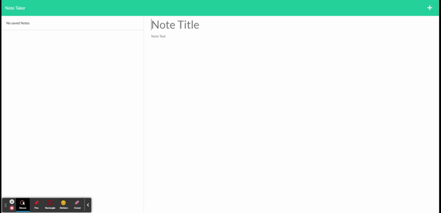

# Note-Taker

## Introduction

Note Taker Application:

This application is a simple tool to take notes. T o install it simply git clone it on your pc, then in the terminal ove to the app folder, then type:

* npm install
* npm i express
* npm start

Then on your browser type http://localhost:3001/ to acces the app.

## Links

* URL of my Repository:

https://github.com/TristanLibeau/Note-Taker

* Url of the walkthrough video

https://note-taker-tristan-libeau.herokuapp.com/notes

## Functionality:

* WHEN I open the Note Taker
* THEN I am presented with a landing page with a link to a notes page
* WHEN I click on the link to the notes page
* THEN I am presented with a page with existing notes listed in the left-hand column, plus empty fields to enter a new note title and           the note’s text in the right-hand column
* WHEN I enter a new note title and the note’s text
* THEN a Save icon appears in the navigation at the top of the page
* WHEN I click on the Save icon
* THEN the new note I have entered is saved and appears in the left-hand column with the other existing notes
* WHEN I click on an existing note in the list in the left-hand column
* THEN that note appears in the right-hand column
* WHEN I click on the Write icon in the navigation at the top of the page
* THEN I am presented with empty fields to enter a new note title and the note’s text in the right-hand column

## Mock-Up 

* The following Gif shows the process of the final application

## Credits

* StackOverflaw 
* BootCamp Course
* https://www.youtube.com/watch?v=MxfxiR8TVNU&ab_channel=JonnyKalambay